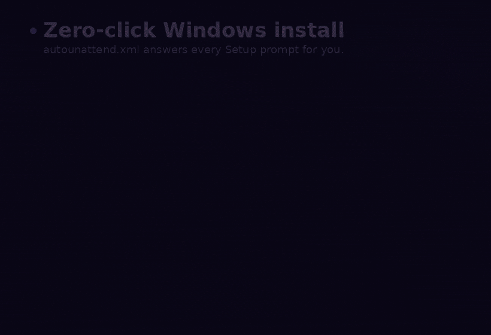

<div align="center">

<a href="https://kyarick.github.io/preflight.xml/">
  
</a>

<br>

<p>
  <a href="https://github.com/kYaRick/preflight.xml/releases"></a>
  <a href="https://dotnet.microsoft.com/"></a>
  <a href="https://learn.microsoft.com/aspnet/core/blazor/"></a>
  <a href="https://www.fluentui-blazor.net/"></a>
  <a href="https://web.dev/progressive-web-apps/"></a>
  <a href="LICENSE"></a>
</p>

<sub><strong>Zero install · zero backend · zero XML edits by hand.</strong></sub>

</div>

> [!WARNING]
> **Pre-alpha.** The Blazor app is being scaffolded - APIs, UI and file
> layout can change without notice until `v0.1.2`. Pin to a specific tag
> if you depend on it.

---

## 🧭 What it is

`preflight.xml` helps IT admins, sysadmins and homelabbers craft
`autounattend.xml` answer files for unattended Windows 10 / 11 installs
- **without touching raw XML**. Everything runs in the browser; your
config never leaves your machine.

> [!NOTE]
> New to the `autounattend.xml` format? Microsoft's
> [Unattended Windows Setup Reference](https://learn.microsoft.com/en-us/windows-hardware/customize/desktop/unattend/)
> is the canonical source.

## 🖥️ App showcase

<div align="center">
  
  <sub>UI overview: landing, desktop splash and in-app experience.</sub>
</div>

<br>

## 🧠 How autounattend.xml works

<div align="center">
  
  <sub>Concept flow: how autounattend.xml answers Windows Setup prompts end-to-end.</sub>
</div>

## 🎯 Planned features

<table>
<tr>
<td valign="top" width="50%">

- 🖼️ Visual editor for every major pass & component
- 👀 Live XML preview with syntax highlighting
- 💽 Disk layout configurator (GPT / MBR, EFI, Recovery)
- 👤 User accounts & credential management
- 🔒 Privacy, telemetry & security toggles

</td>
<td valign="top" width="50%">

- 🧼 Bloatware removal & app provisioning
- 📜 Custom PowerShell / CMD script injection
- 📥 Import / export of saved configurations
- 📴 Full offline support via PWA
- 🌍 i18n-ready UI

</td>
</tr>
</table>

## 🧱 Tech stack

|         Layer | Choice                                        |
| ------------: | :-------------------------------------------- |
|       Runtime | **.NET 10** · **Blazor WebAssembly**          |
|            UI | **Microsoft Fluent UI** for Blazor            |
|       Hosting | **GitHub Pages** (static, no backend)         |
|  Distribution | Installable **PWA**, fully offline-capable    |
|      Upstream | Vendors [`cschneegans/unattend-generator`][1] |

[1]: https://github.com/cschneegans/unattend-generator

---

## 🚀 Getting started

### Prerequisites

- [.NET 10 SDK](https://dotnet.microsoft.com/download)
- [`just`](https://github.com/casey/just) - the command runner

<details>
<summary>Install <code>just</code></summary>

```bash
winget install Casey.Just     # Windows
brew install just             # macOS
cargo install just            # any platform (Rust)
scoop install just            # Windows (Scoop)
```

</details>

### Clone & bootstrap

```bash
git clone https://github.com/kYaRick/preflight.xml.git
cd preflight.xml
just init        # configures git hooks, restores NuGet packages
```

### Everyday commands

Run `just` with no args to list every recipe.

| Command         | What it does                                  |
| :-------------- | :-------------------------------------------- |
| `just init`     | One-time onboarding setup                     |
| `just run`      | Start the app with hot-reload                 |
| `just build`    | Build all projects (Debug)                    |
| `just test`     | Run the test suite                            |
| `just format`   | Auto-format source                            |
| `just lint`     | Verify formatting (CI-friendly)               |
| `just publish`  | Produce a release build for GitHub Pages      |
| `just serve`    | Serve the published site at `:8080`           |
| `just clean`    | Remove all build artifacts                    |

> [!TIP]
> `just publish` accepts an optional base path:
> ```bash
> just publish                     # /preflight.xml/  (GitHub Pages)
> just publish /                   # /                (custom domain / localhost)
> just publish /apps/preflight/    # /apps/preflight/ (reverse proxy)
> ```

> [!NOTE]
> Prefer raw `dotnet`? The `justfile` is short and readable - every
> recipe is a thin wrapper.

---

## 📦 Distribution

| Channel                  | How it works                                                                                                  |
| :----------------------- | :------------------------------------------------------------------------------------------------------------ |
| 🌐 **Live web app**      | Push to `main` → deployed to GitHub Pages by [`pages.yml`](.github/workflows/pages.yml)                       |
| 📱 **Installable PWA**   | Visit the live app, tap the install icon - works on Windows, macOS, Linux, Android, iOS                       |
| 📥 **Offline archive**   | Push tag `vX.Y.Z` → zip + tar.gz attached to the Release by [`release.yml`](.github/workflows/release.yml)     |
| 🧰 **Self-host**         | Extract the archive, serve `wwwroot/` with any static server (see [releasing.md](docs/releasing.md))           |

> [!IMPORTANT]
> First-time Pages deploy needs a one-time repo setting:
> **Settings → Pages → Source = GitHub Actions**. See
> [docs/ci-cd.md](docs/ci-cd.md#one-time-repo-setup) for the full checklist.

---

## 📚 Documentation

| Topic                 | Read                                           |
| :-------------------- | :--------------------------------------------- |
| Architecture overview | [docs/architecture.md](docs/architecture.md)   |
| CI / CD pipelines     | [docs/ci-cd.md](docs/ci-cd.md)                 |
| Publishing & PWA      | [docs/publishing.md](docs/publishing.md)       |
| Cutting a release     | [docs/releasing.md](docs/releasing.md)         |
| Upstream vendor sync  | [docs/upstream-sync.md](docs/upstream-sync.md) |

---

## 🤝 Contributing

Contributions are welcome once the app scaffold lands.

1. Open an issue first to discuss the change.
2. Follow [Conventional Commits](https://www.conventionalcommits.org/) - see [`.gitmessage`](.gitmessage).
3. Keep diffs focused and small; read [CONTRIBUTING.md](CONTRIBUTING.md).

Security issues → [SECURITY.md](SECURITY.md) (do **not** file a public issue).

## 📜 License

Released under the [MIT License](LICENSE) © [kYaRick](https://github.com/kYaRick).
Vendored portions of `Preflight.Unattend` remain under their upstream
MIT license - see [`NOTICE`](NOTICE) and [`LICENSES/`](LICENSES/).

---

## 🇺🇦 Stand with Ukraine

Built by a Ukrainian developer during an ongoing war. If `preflight.xml`
saves you time, please consider supporting the people defending Europe's
eastern border:

- 🛡️ **[Хартія · Kharchenko Foundation](https://www.khartiiafoundation.com/)** - equipment, medical aid and training for Ukraine's defenders
- 🦅 **[Azov ONE](https://azov.one/fundraisers)** - fundraising hub for Azov brigade units on the front line

Any contribution matters.

<div align="center">
<sub>✨ Made with love to 💛 Ukraine 💙</sub>
</div>
