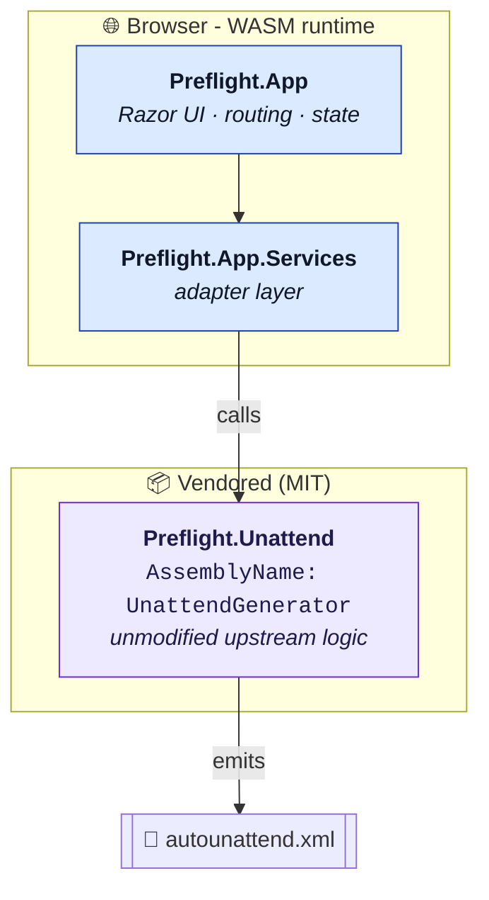

<div align="center">

# 🏛️ Architecture

<sub>A client-only Blazor WebAssembly app with one vendored dependency.</sub>

</div>

No backend. No database. No server-side rendering. Everything happens in
the user's browser - their config never leaves their machine.

---

## 📁 Repo layout

```
preflight.xml/
├── srcs/
│   ├── Preflight.App/              # Blazor WASM UI + adapter services
│   │   ├── Pages/                  #   Razor pages & components
│   │   ├── Services/               #   App-level services (adapter layer)
│   │   ├── Resources/              #   i18n .resx files
│   │   └── wwwroot/                #   Static assets shipped to the browser
│   └── Preflight.Unattend/         # Vendored library - see upstream-sync.md
├── tests/
│   └── Preflight.Tests/            # Unit tests
└── artifacts/                      # Build output (git-ignored)
    └── app/Preflight.App/publish/
        └── wwwroot/                # ← the static site
```

## 🧩 Module boundary



> [!IMPORTANT]
> **The adapter rule.** `Preflight.App.Services` is the **only** place
> that touches `Schneegans.Unattend` types. When upstream changes an
> API, the adapter absorbs the diff so Razor components don't need to
> care. This keeps upstream syncs mechanical (see
> [upstream-sync.md](upstream-sync.md)).
-
## 🔑 Why the assembly name is `UnattendGenerator`

`resource/Bloatware.json` inside the vendored library contains
Newtonsoft `$type` metadata strings like:

```json
"$type": "Schneegans.Unattend.PackageBloatwareStep, UnattendGenerator"
```

Newtonsoft resolves assemblies **by name** at runtime. Renaming the
assembly breaks deserialization the first time the catalog loads,
crashing the generator's constructor.

> [!CAUTION]
> The `AssemblyName = UnattendGenerator` pin is **load-bearing**. Do not
> touch it casually. The full reasoning lives in a comment in
> [`Preflight.Unattend.csproj`](../srcs/Preflight.Unattend/Preflight.Unattend.csproj).

## 🔄 Runtime flow

```mermaid
sequenceDiagram
    participant U as 👤 User
    participant UI as Razor UI
    participant Svc as Adapter
    participant Gen as UnattendGenerator
    U->>UI: toggle setting / fill field
    UI->>Svc: bind update
    Svc->>Gen: project state → generator model
    Gen-->>Svc: UnattendXml document-
    Svc-->>UI: serialized string
    UI-->>U: live preview + download button
```-

## 📦 Dependencies at a glance

|      Layer | Package                                         | Why                                   |
| ---------: | :---------------------------------------------- | :------------------------------------ |
|    Runtime | `Microsoft.AspNetCore.Components.WebAssembly`   | Blazor WASM host                      |
|         UI | `Microsoft.FluentUI.AspNetCore.Components`      | Fluent 2 controls                     |
|       i18n | `Microsoft.Extensions.Localization`             | Resource-based localization           |
|   Markdown | `Markdig`                                       | In-app Docs pages                     |
|  Generator | `Newtonsoft.Json` <sup>via `Preflight.Unattend`</sup> | `$type` polymorphism - see above |

> [!WARNING]
> `Microsoft.FluentUI.AspNetCore.Components.Icons` is **deliberately not
> referenced**. The full icon set adds ~100 MB of WASM assemblies that
> Blazor tries to download on startup - dev hangs, prod bundle explodes.
> We use emoji + inline SVG instead. See the comment in
> [`Preflight.App.csproj`](../srcs/Preflight.App/Preflight.App.csproj).

<sub>← Back to the [docs index](README.md).</sub>
