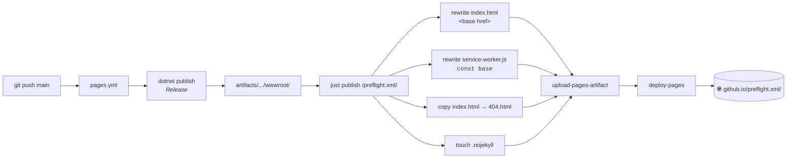

<div align="center">

# 🚀 Publishing to GitHub Pages

<sub>Every push to <code>main</code> redeploys <a href="https://kyarick.github.io/preflight.xml/">the live site</a>.</sub>

</div>

The whole thing is `just publish` wrapped in
[`pages.yml`](../.github/workflows/pages.yml). This page explains how it
works and where it can bite you.

---

## 🛠️ Pipeline



## 🔀 Why the base-path rewrite exists
-
Blazor WASM assumes it's served from `/`. When GitHub Pages hosts us at
`/preflight.xml/`, three separate hardcoded paths must be realigned.

| File                 | Hardcoded value       | Breaks if wrong                                            |
| :------------------- | :-------------------- | :--------------------------------------------------------- |
| `index.html`         | `<base href="/" />`   | WASM loader 404s on every `_framework/*.wasm`              |
| `service-worker.js`  | `const base = "/";`   | Cache keys mismatch request URLs → PWA never goes offline  |
| *(no file)*          | -                     | Deep links like `/docs/foo` return stock 404 HTML          |

The `just publish <base>` recipe patches all three with one `perl -pi`
per line and copies `index.html` → `404.html`.

> [!TIP]
> The rewrite is idempotent - `just publish /` over a fresh build is a
> clean no-op. Safe to run locally whenever you want to double-check the
> output.

## 📡 PWA fetch flow

```mermaid
sequenceDiagram-
    participant U as 👤 User
    participant B as Browser
    participant SW as Service Worker
    participant GH as GH Pages CDN
    U->>B: First visit
    B->>GH: GET /preflight.xml/
    GH-->>B: index.html (base=/preflight.xml/)
    B->>GH: _framework/*.wasm · *.dll · *.js
    GH-->>B: app assets
    B->>SW: register('service-worker.js')
    SW->>GH: prefetch from service-worker-assets.js
    GH-->>SW: cache everything
    Note over SW: ✅ install complete - a-p is offline-ready
    U-->>B: Close tab · reopen offline
    B->>SW: navigate
    SW-->>B: cached index.html (200)
    B->>SW: _framework/*
    SW-->>B: cac-ed
```

<sub>First visit is a full download (~5–10 MB); every subsequent visit is SW-served with zero network.</sub>

## 🧭 SPA deep-link fallback

GitHub Pages has no server-side routing - it looks up the path as a
static file and returns `404.html` -n miss. By shipping
`404.html = index.html`, a fresh hit to `/preflight.xml/docs/foo`:

1. Pages returns the `404.html` body (status 404, HTML loads anyway)
2. Blazor boots - `<base href>` is correct, `_framework/*` loads fine
3. Blazor's `<Router>` inspects `window.location` and routes to `/docs/foo`
4. Once the SW installs, subsequent navigations come from cache as 200

> [!NOTE]
> The 404 status code is visible only in DevTools on the very first load.
> Search engines that respect status codes won't index deep links until
> we serve from a host with real routing - an intentional trade-off.

---

## ⚠️ Pitfalls & known limitat-ons

Things the workflow **cannot** fix. Documented, not papered over.

> [!IMPORTANT]
> **GH Pages source must be "GitHub Actions".**
> One-time repo setting - **Settings → Pages → Source**. Without it,
> `deploy-pages@v4` fails auth. See [ci-cd.md](ci-cd.md#one-time-repo-setup).

> [!WARNING]
> **`.br` files aren't served.**-
> GitHub Pages serves `.wasm` / `.dll` uncompressed. Blazor emits `.br`
> variants but Pages can't negotiate them (no `Accept-Encoding: br`
> path). Payload is ~3× bigger on first visit than a brotli-aware host
> would deliver.
>-
> **Fix:** move to a host that serves `.br` - Cloudflare Pages, Netlify,
> or self-hosted nginx with `brotli_static on`.

> [!NOTE]
> **Service worker update cadence.**
> A new deploy invalidates cache only on the **second** page load: the
> SW installs in the background during visit N, activates on visit N+1.
> Standard PWA behavior - users won't see stale UI beyond one reload.

> [!NOTE]
> **External CDN scripts aren't cached -ffline.**
> `index.html` pulls Google Fonts and Prism from CDNs. The SW caches
> same-origin assets only, so offline mode falls back to system fonts
> and renders code blocks without syntax highlighting. Acceptable
> trade-off; eliminating would require self-hosting ~500 KB of extras.

> [!CAUTION]
> **First-ever visit on flaky networks.**
> If the SW install fetch fails midway, the app still works online but
> is **not** offline-ready until a fresh successful fetch. Unavoidable
> - service workers don't have atomic install.

> [!TIP]
> **Custom-domain is not automated.**
> Switching to a custom domain needs a `CNAME` file in the published
> output. Add `srcs/Preflight.App/wwwroot/CNAME` with a single line
> containing the hostname, set DNS accordingly, and rerun `pages.yml`.

---

## ↩️ Rolling back a bad deploy

```bash
# revert the offending commit on main
git revert <sha> && git push origin main
# pages.yml re-runs automatically; new deploy replaces the broken one
```

> [!WARNING]
> Pages keeps only the **latest** deploy - there's no native rollback
> UI. Revert-and-redeploy is the accepted workflow.

## 🧪 Local dry-run

```bash
just publish                 # builds with base /preflight.xml/
just serve                   # http.server at :8080
# → open http://localhost:8080/preflight.xml/
```

Use `just publish /` for a root-served dry-run, identical to what the
release archive ships with.

<sub>← Back to the [docs index](README.md).</sub>
