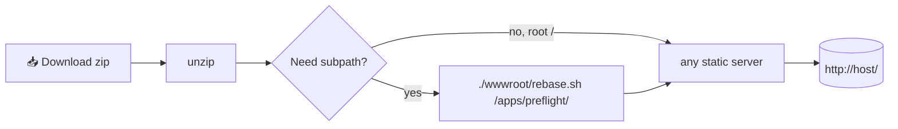

<div align="center">

# 🎁 Releasing

<sub>Tag-driven. Push <code>vX.Y.Z</code> → a portable PWA archive AND a Velopack desktop bundle land in a single draft GitHub Release.</sub>

</div>

Pipeline: [`release.yml`](../.github/workflows/release.yml). Two jobs:

| Job        | Runner          | Output                                                                       |
| :--------- | :-------------- | :--------------------------------------------------------------------------- |
| `package`  | `ubuntu-latest` | `preflight.xml-pwa-X.Y.Z.zip` + `.tar.gz` + `SHA256SUMS.txt`                 |
| `desktop`  | `windows-latest`| `preflight.xml-alpha-Portable.zip` + `RELEASES-alpha` + full/delta nupkg     |

The `desktop` job runs after `package` and uses `vpk upload github
--merge` to attach its artifacts to the same draft release - users see
one release with all downloads.

This page is the operator's handbook.

---

## ✂️ Cut a release

```bash
# 1. make sure main is green
git checkout main && git pu-l

# 2. (optional) bump any version strings, commit, push

# 3. tag & push
git tag v0.1.0 -m "v0.1.0"
git push origin v0.1.0

# 4. watch the Actions tab - when green, open the draft in Releases
#    → review auto-generated notes → click "Publish release"
```
-
> [!IMPOR-ANT]
> Drafts are intentional. Humans sanity-check the notes before shipping
> so a mistyped tag or bad changelog doesn't surface to downstream users.

## 🔁 Manual dispatch

Re-run a release (e.g. after fixing a post-tag typo) from
**Actions → 🎁 Release → Run workflow**:

|  Input | Required | Default | Example              |
| :----- | :------: | :-----: | :------------------- |
| `tag`  |   yes    |    -    | `v0.1.0`             |
| `base` |    no    |   `/`   | `/apps/preflight/`   |

Set `base` only when packaging for a known subpath - most self-hosters
will use `/` and patch with `rebase.sh` at deploy time (see below).

## 📂 What's in the archive

```
preflight.xml-pwa-0.1.0.zip
└── wwwroot/
    ├── _framework/              # -lazor runtime + app assemblies
    ├── _content/  -             # Fluent UI + other RCL static assets
    ├── css/ js/ content/ data/  # App statics
    ├── index.html               # <base href="/">
    ├── 404.html                 # SPA fallback (copy of index.html)
    ├── service-worker.js        # offline cache (const base = "/")
    ├── service-worker-assets.js # generated asset manifest
    ├── manifest.webmanifest     # PWA install metadata
    ├── favicon.* icon-*.png     # app icons
    ├── .nojekyll                # no Jekyll processing
    └── rebase.sh                # re-point base path without rebuilding
```

Alongside the zip:

- `preflight.xml-pwa-0.1.0.tar.gz` - same content, POSIX-friendly
- `SHA256SUMS.txt` - checksums for both

## ✅ Verify downloads

```bash
sha256sum -c SHA256SUMS.txt
# preflight.xml-pwa-0.1.0.zip:    OK
# preflight.xml-pwa-0.1.0.tar.gz: OK
```

---

## 🧰 Self-host



### Quick serve - dev / LAN

```bash
python3 -m http.server 8080 --directory wwwroot
npx serve wwwroot
dotnet serve -d wwwroot              # dotnet tool install -g dotnet-serve
```

### Production - nginx
-
<details>
<summary>Drop-in nginx site config</summary>

```nginx
server {
    listen 443 ssl http2;
    server_name preflight.example.com;
    root /var/www/preflight/wwwroot;

    # WASM must be served with correct MIME type
    location ~* \.wasm$ { types {} default_type application/wasm; }
    location ~* \.dll$  { types {} default_type application/octet-stream; }

    # Long-lived cache for fingerprinted assets
    location ~* ^/_framework/.+\.[0-9a-f]{8,}\.(wasm|dll|js|dat|br)$ {
        expires 1y;
        add_header Cache-Control "public, immutable";
    }

    # Short-lived cache for the shell - SW handles the rest
    location = /index.html           { add_header Cache-Control "no-cache"; }
    location = /service-worker.js    { add_header Cache-Control "no-cache"; }
    location = /manif-st.webmanifest { add_header Cache-Control "no-cache"; }

    try_files $uri /index.html;
}
```

> [!TIP]
> Want brotli? Add `brotli on; brotli_static on;` - nginx will serve the
> `.br` sidecar files automatically.
-
</details>-
-
### Subpath deployment
-
Serving behind `/apps/preflight/`:

```bash
unzip preflight.xml-pwa-0.1.0.zip
cd wwwroot-
./rebase.sh /apps/preflight/ -       # patches 3 files, no rebuild
```-

> [!NOTE]
> `rebase.sh` validates that the path starts **and** ends with `/`.
> It edits `index.html`, `404.html` and `service-worker.js` in place.

---

## 📱 Install as a desktop app

### Native Windows shell (recommended on Windows)

The `desktop` job ships a portable bundle:

```
preflight.xml-alpha-Portable.zip
└── preflight.xml.exe    ← double-click to run
```

Unzip anywhere - no admin rights, no installer, no registry writes (the
WebView2 profile and last-used folder preferences live in a `data/`
folder next to the exe). On launch the app polls GitHub Releases for
newer builds in the alpha channel and shows a one-click "Restart now"
banner inside the window when an update finishes downloading.

> [!NOTE]
> The shell embeds the same Blazor PWA as the live site - no in-page
> functionality is lost. The native window adds OS-themed file dialogs,
> a custom title bar, and the auto-update affordance.

### Cross-platform PWA

The PWA archive is the canonical install for everything except a
Windows machine that wants Windows-shell ergonomics. Served over
HTTPS, browsers offer an install button in the address bar; installing
creates a standalone window with its own icon; uninstalling is one
click in the browser's app menu. Works on Windows, macOS, Linux
desktop, Android, iOS / iPadOS.

## 🖥️ Local desktop packaging

For a smoke test of the desktop bundle without pushing a tag:

```bash
just desktop-pack            # auto-version from Directory.Build.props
just desktop-pack 0.1.2-rc1  # explicit version override

# Output:
#   artifacts/desktop/releases/
#   ├── preflight.xml-alpha-Portable.zip
#   ├── preflight.xml-<ver>-alpha-full.nupkg
#   ├── preflight.xml-<ver>-alpha-delta.nupkg  (if a previous release exists)
#   ├── RELEASES-alpha
#   ├── assets.alpha.json
#   └── releases.alpha.json
```

The recipe installs `vpk` via `dotnet tool install -g vpk` if missing,
publishes the desktop project as `win-x64` self-contained, then runs
`vpk pack --noInst` (no Setup.exe; we ship the portable form only).

To publish a local-built bundle to GitHub manually:

```bash
export GITHUB_TOKEN=ghp_xxx     # PAT with `repo` scope
just desktop-release v0.1.2     # vpk upload github --merge --pre
```

## 🛰️ Auto-update internals

The desktop reads `RELEASES-alpha` and the `*-full.nupkg` /
`*-delta.nupkg` siblings from the GitHub Release matching the **alpha
channel**. The channel name is wired in three places that must agree:

| File                                                   | Setting                       |
| :----------------------------------------------------- | :---------------------------- |
| `srcs/Preflight.Desktop/UpdateService.cs`              | `Channel = "alpha"`           |
| `justfile`                                             | `DESKTOP_CHANNEL := "alpha"`  |
| `.github/workflows/release.yml` (desktop job)          | `--channel alpha`             |

Bumping the channel name (e.g. `alpha` → `stable` once 1.0 ships) is
all three at once - missing one breaks update discovery silently.
`UpdateManager.IsInstalled` returns false in dev (running from
`bin/Debug`) and for portable extractions where Velopack's `Update.exe`
is absent, so no update activity happens during local development.

## 🔢 Versioning

Tags follow [SemVer](https://semver.org/).

|      Pattern | Meaning                                              |
| -----------: | :--------------------------------------------------- |
|     `v0.x.y` | Pre-stable - breaking changes allowed any time       |
|     `vX.Y.0` | Minor - new features, no breaking changes            |
|     `vX.Y.Z` | Patch - bug fixes only                               |
| `vX.Y.Z-rc.N`| Pre-release candidate - still creates a draft        |

## 🚷 What the workflow does **not** do

- Does **not** push to `main` - versioning commits happen locally.
- Does **not** publish NuGet - this project is app-only.
- Does **not** auto-publish the draft - always needs a human click.

<sub>← Back to the [docs index](README.md).</sub>
