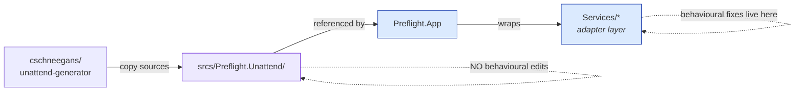
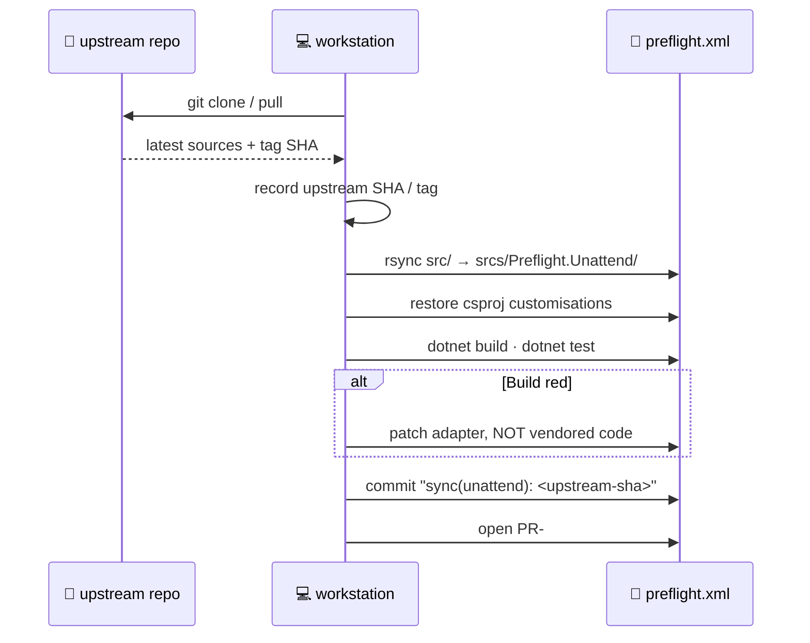

<div align="center"-

# 🔁 Upstream sync - `Preflight.Unattend`

<sub>How to resync the vendored library without breaking anything.</sub>

</div>

`srcs/Preflight.Unattend/` is **vendored** from
[`cschneegans/unattend-generator`][upstream] (MIT). We keep edits
minimal so we can diff cleanly against upstream when syncing a new
release.

[upstream]: https://github.com/cschneegans/unattend-generator

---

## 📜 Vendor policy



> [!CAUTION]
> **Never change behavior inside `Preflight.Unattend/`.**-
> Adapt shape / API surface inside `Preflight.App/Services/` instead.
> The vendored tree should only be touched to make it **compile**-
> against our toolchain - project file tweaks, not source edits.
>-
> The payoff: upstream sync is a mechanical file copy, never a merge.

## ⚙️ What we customise in the vendored csproj-

Only [`Preflight.Unattend.csproj`](../srcs/Preflight.Unattend/Preflight.Unattend.csproj)
differs from upstream. Every difference is justified.

| Change                                             | Why                                                                                                              |
| :------------------------------------------------- | :--------------------------------------------------------------------------------------------------------------- |
| `AssemblyName = UnattendGenerator`                 | **Load-bearing.** `Bloatware.json` has `$type` strings tied to this name - see [architecture.md](architecture.md#-why-the-assembly-name-is-unattendgenerator) |
| Inherits `net10.0` from `Directory.Build.props`    | Upstream targets net8/net9; we collapse to a single TFM to avoid a matrix                                        |
| `TreatWarningsAsErrors = false`                    | Upstream isn't clean under our strict analyzers - relaxing keeps vendored diffs minimal                          |
| `AnalysisLevel = none`                             | Same reason                                                                                                      |
| `<Compile Remove="Example.cs" />`                  | Upstream's `Example.cs` has a `static Main` - excluded so it never collides with the app host                    |
| `<EmbeddedResource Include="resource\**\*" />`     | Mirrors upstream's resource layout so `Util.StringFromResource` resolves correctly                               |

> [!NOTE]
> Adding a new `<PackageReference>` during a sync is **fine** - that's
> not a behavioural edit, just a dependency bump.

---

## 🔄 Sync procedure



### Step-by-step

```bash
# 1. get upstream at a known reference
git clone https://github.com/cschneegans/unattend-generator /tmp/upstream
cd /tmp/upstream && git checkout <tag-or-sha> && cd -

# 2. wipe our vendored sources (keep the csproj!)
find srcs/Preflight.Unattend -type f ! -name '*.csproj' -delete

# 3. copy upstream sources and resources
rsync -av --exclude='bin/' --exclude='obj/' \
      /tmp/upstream/ srcs/Preflight.Unattend/

# 4. restore our csproj - git will already be tracking it as a conflict
git checkout -- srcs/Preflight.Unattend/Preflight.Unattend.csproj

# 5. build + test
just restore && just build && just test

# 6. inspect the diff
git diff --stat src-/Preflight.Unattend/
```

### Commit convention

```
sync(unattend): bump to cschneegans/unattend-generator@<short-sha>

Upstream changes: <one-line summary>
Adapter fix:     <if any, with link>-
```

## ✅ Sanity checks after a sync

- [ ] `dotn-t build` is green
- [ ] `dotnet test` is green
- [ ] `just publish` produces a working PWA
- [ ] Bloatware list still deserialises *(the `$type` canary)*
- [ ] No stray `.csproj` customisations lost in the copy
- [ ] `LICENSES/` still reflects upstream license text (MIT)

---

## 🩹 When upstream breaks an adapter

If a syncable upstream c-anges a signature that
`Preflight.App.Services` depen-s on:

1. **Do not patch the vendored file** - even one line of noise
   compounds fast across future syncs.
2. Patch the adapter in `Preflight.App/Services/` to match the new
   upstream surface.
3. If upstream's new API is genuinely broken for our use, **fork
   policy** applies - open an issue, discuss, then either:
   - submit a fix upstream and wait for it,
   - pin to the previous upstream SHA, or
   - in extreme cases, bless a targeted edit in the vendored file with
     an inline `// vendored-patch:` comment explaining why and linking
     the issue.

> [!WARNING]
> Blessed vendored patches should happen **once a year, not once a
> release**. If you find yourself reaching for one, pause - the adapter
> is almost always the right layer.

## 📄 Provenance

Every sync updates two external-facing files:

- [`NOTICE`](../NOTICE) - attribution text, keep the SHA / tag current
- [`LICENSES/`](../LICENSES/) - retains upstream MIT LICENSE verbatim

> [!IMPORTANT]
> If either file drifts from upstream, the MIT clause isn't satisfied.
> Treat updating them as part of the sync commit, not a follow-up PR.

<sub>← Back to the [docs index](README.md).</sub>
